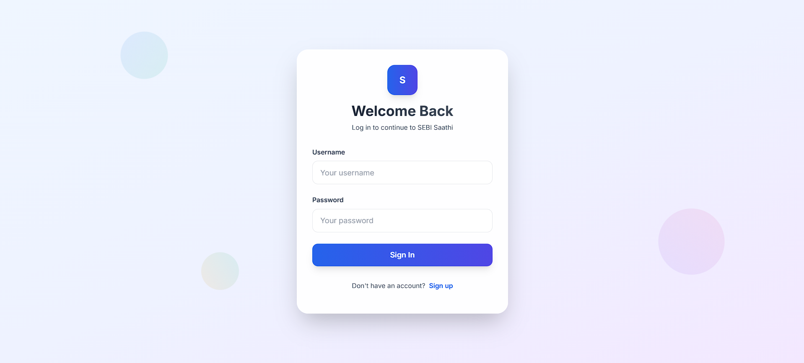
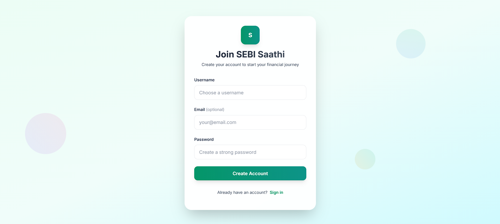
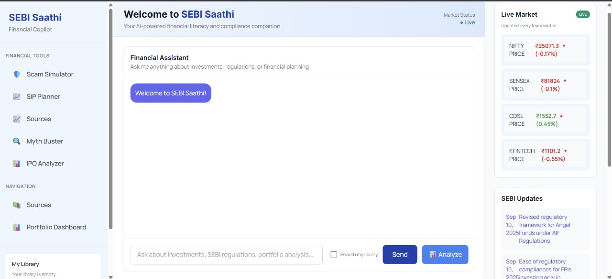
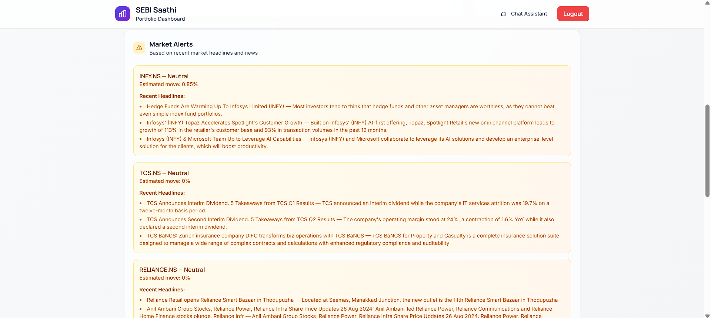
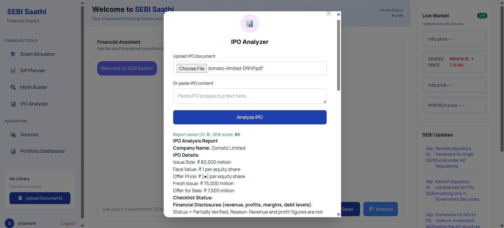

# 📊 SEBI Saathi - Financial Copilot

SEBI Saathi is an AI-powered **financial assistant** that helps users navigate Indian finance, SEBI circulars, IPOs, portfolios, and budget-related queries. It leverages **RAG (Retrieval-Augmented Generation)** with LLMs for accurate answers, while also offering user authentication and portfolio management.

---

## ✨ Features

* 🤖 **AI Q\&A**: Ask finance, banking, and SEBI-related questions.
* 📑 **Document Ingestion**: Add PDFs, advisories, and circulars to the knowledge base.
* 📈 **Live Market Data**: Fetch stock details using Yahoo Finance API.
* 📊 **Portfolio Management**: Register/login and track your personal portfolio.
* 📰 **SEBI Circulars Scraping**: Stay updated with the latest official advisories.
* 🔐 **User Authentication**: Secure login, registration, and session handling.
* 🐳 **Docker Support**: Run easily with Docker & docker-compose.

---

## 🛠️ Tech Stack

* **Backend**: Flask, Flask-Login, Flask-SQLAlchemy
* **AI/LLM**: LangChain, Groq LLaMA 3, HuggingFace Embeddings
* **Vector DB**: Chroma
* **Frontend**: HTML, CSS, JavaScript (Flask templates)
* **Database**: SQLite
* **Others**: Yahoo Finance (yfinance), BeautifulSoup (scraping), Docker

---

## 📂 Project Structure

```
sebi2/
│── app.py                # LLM + Vector DB setup
│── backend.py            # Flask backend with APIs, auth, portfolio, scraping
│── ingest.py             # Ingest new documents into vector store
│── models.py             # Database models (User, Portfolio)
│── templates/            # HTML templates (dashboard, login, register, etc.)
│── static/               # JavaScript & static assets
│── data/                 # PDFs, JSONs, SEBI advisories, FAQs
│── vector_store/         # Chroma vector DB storage
│── docker-compose.yml    # Docker multi-service setup
│── Dockerfile            # Build instructions
│── requirements.txt      # Python dependencies
```

---

## 🚀 Getting Started

### 1️⃣ Clone the Repository

```bash
git clone https://github.com/yourusername/sebi-saathi.git
cd sebi-saathi/sebi2
```

### 2️⃣ Setup Environment

```bash
python -m venv venv
source venv/bin/activate   # (Linux/Mac)
venv\Scripts\activate      # (Windows)

pip install -r requirements.txt
```

### 3️⃣ Environment Variables

Create a `.env` file in `sebi2/`:

```env
GROQ_API_KEY=your_groq_api_key
SECRET_KEY=your_secret_key
```

### 4️⃣ Run the App

```bash
python backend.py
```

Visit: [**http://127.0.0.1:5000**](http://127.0.0.1:5000)

### 🐳 Run with Docker

```bash
docker-compose up --build
```

---

## 📸 Screenshots

Here are some example pages from **SEBI Saathi**:

### 🔑 Login Page



### 📝 Register Page



### 🏠 Dashboard




### 🤖 Chat Interface


### 📊 Portfolio Page




### 📊 IPO Analyzer 



*(Place your actual screenshots in a `screenshots/` folder in the repo and update these paths.)*

---

## 🤝 Contribution

Pull requests are welcome! Please open an issue for major changes before contributing.

---

## 📜 License

This project is licensed under the **MIT License**.

---

### ⭐ If you like this project, give it a star on GitHub!
